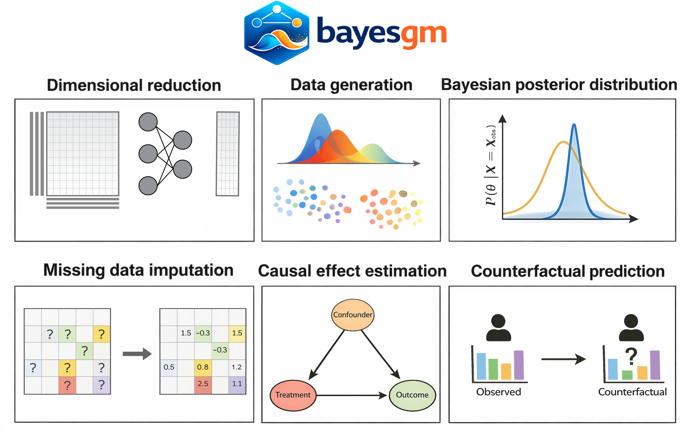

# User guide

`bayesgm` is a toolkit providing a AI-driven Bayesian generative modeling framework for various Bayesian inference tasks in complex, high-dimensional data.

The figure below illustrates the versatility of `bayesgm`, spanning dimensional reduction, data generation, Bayesian posterior inference, missing-data imputation, causal effect estimation, and counterfactual prediction:



## Which model should I use?

Use **BGM** if your goal is:

- conditional prediction/generation,
- missing-data imputation,
- train-once infer-under-different-conditioning workflows.

Use **CausalBGM** if your goal is:

- counterfactual estimation,
- treatment-effect estimation,
- causal inference with uncertainty quantification.

## Package overview

Both models are installed from the same Python package:

```bash
pip install bayesgm
```

Core namespaces:

- `bayesgm.models` for model classes (`BGM`, `CausalBGM`, etc.)
- `bayesgm.datasets` for built-in simulation/semi-synthetic samplers
- `bayesgm.utils` for helpers and data IO

Next steps:

1. Follow the **Installation** page in this section.
2. Open the **BGM** or **CausalBGM** section in the sidebar.
3. Start from the model quickstart block, then continue to tutorials.
